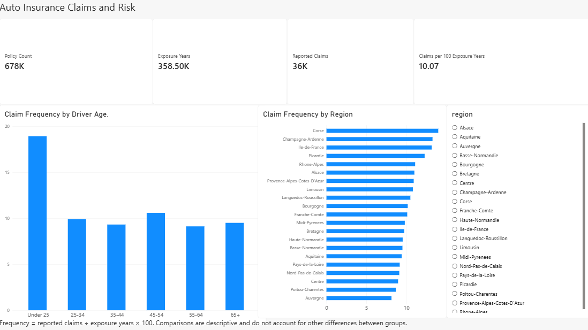
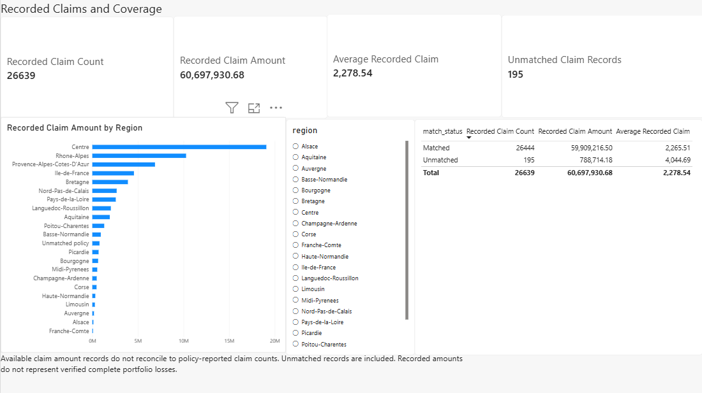

# Auto Insurance Claims and Risk Dashboard

Learning project using PostgreSQL, SQL in VS Code, and Power BI Desktop.

Status: database loaded and SQL checks passed. Both Power BI report pages are built. The saved PBIX is included in powerbi/insurance-risk-dashboard.pbix and report screenshots are included below.

This project explores how reported claim frequency varies by driver age and region. A separate claims page describes available claim amount records and explains incomplete matching between sources.

## Dashboard previews

### Policy Risk Overview

### Recorded Claims and Coverage

[Download the Power BI report](powerbi/insurance-risk-dashboard.pbix). Open it in Power BI Desktop. Refreshing the data requires the local PostgreSQL setup described below.

## The Application of this project

- VS Code: write and organize SQL, notes, and version-controlled project files.
- PostgreSQL: store records and calculate reproducible summaries using SQL.
- Power BI Desktop: connect to PostgreSQL, define measures, and build interactive report pages.
- GitHub: share SQL, report files, screenshots, and an explanation of methods and findings.

## Source files

Place freMTPL2freq.csv and freMTPL2sev.csv in data/raw. These source CSVs are excluded from Git. Download them from the source page below to reproduce the database.

The files correspond to the freMTPL2 insurance datasets. Reference documentation: https://dutangc.github.io/CASdatasets/reference/index.html

Data download page: https://www.kaggle.com/datasets/karansarpal/fremtpl2-french-motor-tpl-insurance-claims

The Kaggle dataset page lists the data license as GPL 2. Original CSVs are excluded from Git; download instructions are provided above. The Import-mode PBIX embeds data derived from these files, so its distribution must retain the applicable source attribution and license notices. The dataset description lists 677,991 policies, while the downloaded CSV used here contains 678,013 records; all project checks use the actual supplied file.

## Initial source checks

Checks performed directly on the supplied CSVs before import:

| Check | Observed result |
| --- | ---: |
| Policy records | 678,013 |
| Duplicate policy IDs | 0 |
| Claim amount records | 26,639 |
| Reported claims in the policy file | 36,102 |
| Claim amount rows with no matching policy | 195 |
| Policies whose reported count differs from matched amount record count | 9,117 |
| Policies with exposure above one year | 1,224 |
| Policies with nonpositive exposure | 0 |

Reported claim counts and available amount records are different populations. Missing claim amounts must not be treated as confirmed zero loss. Preserve source values and document any exclusions. Do not remove repeated claim rows solely because the policy ID repeats.

One policy ID is written as 1.00E+05. The SQL import uses an exact numeric ID type with an integer-value check to handle this representation without altering the identifier. Counts above were also checked after numeric ID normalization.

## Verified SQL findings

Across 358,499.445462177 exposure years, the policy file reports 36,102 claims: 10.0703 claims per 100 exposure years. Drivers under 25 show 18.9284 claims per 100 exposure years over 12,489.161084606 exposure years. These are unadjusted descriptive comparisons, not causal estimates or pricing recommendations.

The claim amount file totals 60,697,930.68 source monetary units. Of that, 788,714.18 belongs to the 195 records with no matching policy. These totals describe recorded amounts, not verified complete portfolio losses. See docs/VALIDATION.md for report reconciliation values.

## Report pages

Page 1: policy count, exposure years, reported claims, and reported claims per 100 exposure years. Compare frequency by driver age band and region with exposure shown alongside rates. A region slicer filters the policy visuals.

Page 2: available claim amount records, recorded claim amounts, and average recorded amount. Show source coverage and matching limitations explicitly. Aggregate claims by policy before joining to avoid multiplying policy exposure.

The source files have no calendar date or premium column, so time trends, loss ratios, and profitability are outside this project's scope.

To reproduce the analysis, download the source CSVs into data/raw, install PostgreSQL, and run setup.ps1 from this repo's project folder. Adjust the PostgreSQL executable path if needed. Then open the Power BI report and connect it to the insurance_dashboard database.
